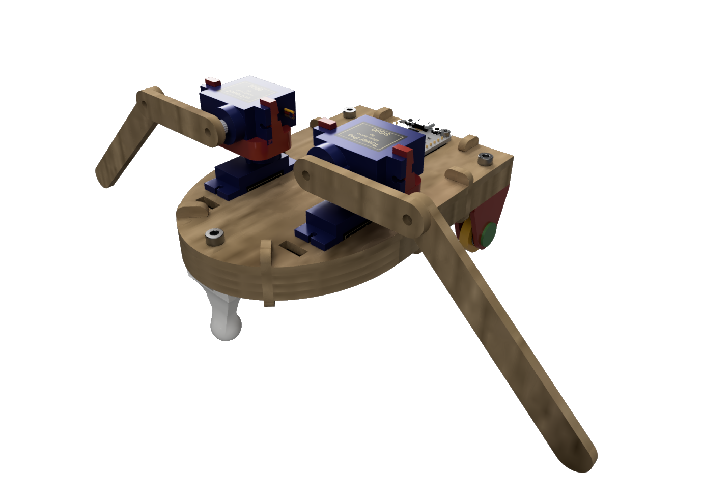
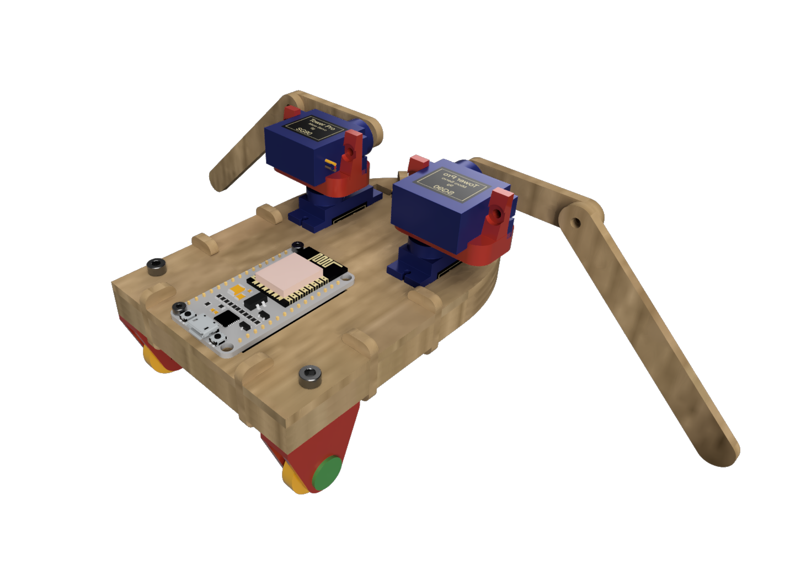
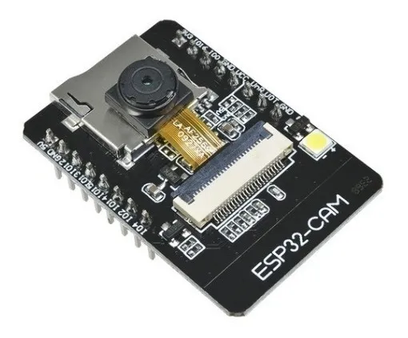

## Assignment

- Plan and sketch a potential final project.

## Robozito 2.0 - Quarantine edition

In this first week we are supposed to start to think about our final project and produce some sketches of it.

{: .left}
{: .right}

My idea is to create a improved version of [Robozito](https://luishfb.github.io/Doc_Robozito/) that allow friend to play over the internet so they can practice social distancing during the Covid-19 pandemic.

 First I would like to fix some points that caused some problems during assembly like:
 
- Clocking the position of the arms correctly with the servos
- Redesigning some 3d printed parts to make them more sturdy
- Make the wire routing easier
- Implement a servo driver so to make motor operation smother

{: .center}

Then swap the ESP8266 with an ESP32 with camera module so it would be possible to use it as a FPV Cam for the remote players.

A point of interest is developing fun activities so people can play remotely, and adapting Robozito to said activities like solving puzzles or navigating some maze.
