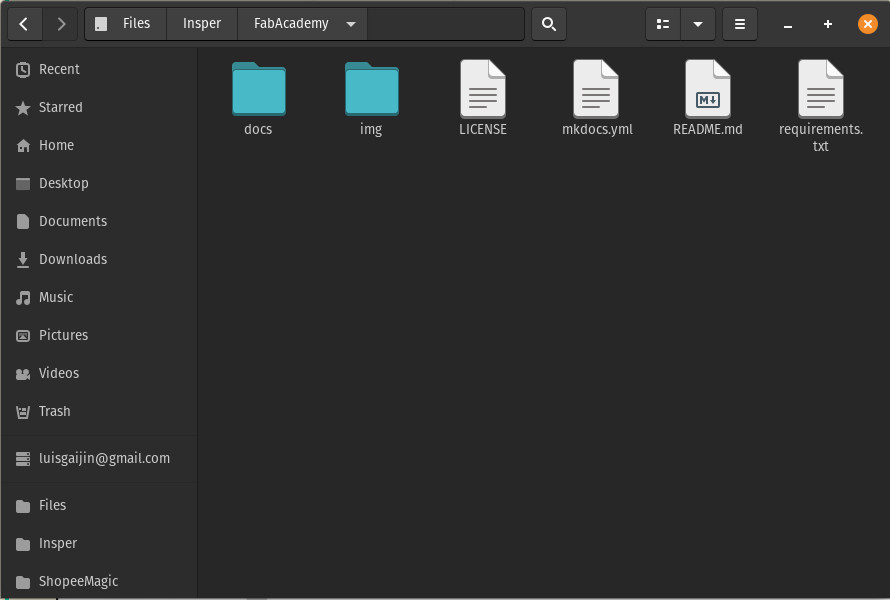

## Assignment

- Work through a git tutorial
- Build a personal site in the class archive describing you and your final project

## Personal Site

For building my documentation page I'll be using [MkDocs](https://www.mkdocs.org/) with the [Material for MkDocs Theme](https://squidfunk.github.io/mkdocs-material/) and [Github](https://github.com/) to create and manage my pages and files.

- **Git**: An open-source version control system used for creating a history of changes in the source code of software's development project.
- **GitHub**: A remote repository hosting service workins as an online Git.
- **Markdown**: A "text-to-HTML conversion tool for web writers" according to Jon Gruber, its creator. It is a tool that allows writing using plain text, converting it to a valid XHTML structure..
- **Mkdocs**: A static website generator for building project documention. Its source files are written in Markdown and set in a single YAML configuration file.

### Installing Python, Git, Mkdocs and Materials for Mkdocs

OS: [Pop!_OS](https://pop.system76.com/)(**Linux**)

Normally Linux comes with Python installed out of the box but to check it use in your terminal:

``` shell
python --version
```

In case Python is not installed check [this link](https://www.python.org/downloads/) and follow the documentation for installation steps.
If it's installed you'll receive a message like the one bellow:

{: .center}

Check if the [Pip](https://pypi.org/project/pip/) command is avaiable by typing the following:

``` shell
pip --version
```

If pip is installed, the terminal will return something like the image bellow:

{: .center}

Usually Pip is installed with Python.

Now is time to install Mkdocs, using the following command in the terminal:

``` 
pip install mkdocs
```

After the installation is done, it is going to be possible to start the website building. In the [Mkdocs website](https://www.mkdocs.org/) you can follow the first steps to prepare the documentation in your own static website. You cand find the guide in the 
[Getting Started](https://www.mkdocs.org/getting-started/) section.
This guide will teach you how to create a new project as wel as adding pages, theming the documentation and using icons through the YAML configuration file.
In my project, I used a theme called [Materials for Mkdocs](https://squidfunk.github.io/mkdocs-material/). Since it is a theme that does not come with Mkdocs, I needed to install it using the following line:

 ```
 pip install mkdocs-material
 ```

With the theme installed, I just needed to set the name **material** on the folowwing line in the mkdocs.yml file to use it.

{: .center}

Write the following command line in the terminal to preview the new site with the Material theme:

 ```
 mkdocs serve
 ```

### Deploying to Github and Automating the Process

Now it is time to deploy our website to GitHub, and finally have it online on the internet. To do it I followed the [Allithy Tutorial](https://allythy.github.io/como-criar-documentacao-com-mkdocs), more specifically in the "Deploy para o Github" section. With the tutorial, we are going to get a URL address for our documentation site. In my case the address was <https://leonrosa.github.io/FabAcademy/>.

Once the files are on the GitHub repository, everytime that we need to make an update we will need to repeat the deployment process. To make this step easier, I chose to automated following the [Parker Erickson tutorial](https://parkererickson.github.io/portfolio/blog/MkDocsCD/).

!!! Important "Install all dependencies before update the documentation."
    - Create the file 'requirement.txt' on the root of the documentation main folder.
        &nbsp;
        
        {.center}
        
        &nbsp;
    
    - Inside the file, write the following lines:
        ```
            mkdocs>=1.1
            mkdocs-material>=7.1
            Pygments>=2.4
            markdown>=3.2
            pymdown-extensions>=7.0
            mkdocs-material-extensions>=1.0
        ```
    - Finally, install them adding the following command in the YAML file found inside the 'my-project\ .github\workflows' folder:
        ```
           - name: Install dependencies
                run: |
                pip install -r requirements.txt
                pip install mkdocs-git-revision-date-plugin
        ```

&nbsp; 

## Code Editor and Terminal
&nbsp;

To build and develop my documentation website, I needed to use a code editor software. The software was needed to edit the YAML files and create the texts in [Markdown](https://www.markdownguide.org/).

In my documentation I chose the [EMACS](https://www.gnu.org/s/emacs/) with the [Spacemacs](https://www.spacemacs.org/) distribution.

I also needed to use the terminal to install and operate the Mkdocs server. My Linux terminal of choice is [ZSH](https://www.zsh.org/) with [OhMyZSH](https://ohmyz.sh/) framework.

Besides my choice, the steps above can also be fulfilled with other code editors like [Notepad++](https://notepad-plus-plus.org/), [Atom](https://atom.io/) and [Sublime](https://www.sublimetext.com/) and/or with other terminals like the Command Prompt from Windows operating system.

&nbsp;

## References
&nbsp;

For more informations related with inserting images, code blocks, buttons, lists, etc. you can read the Material for Mkdocs [references](https://squidfunk.github.io/mkdocs-material/reference/images/).

But the informations in the link doesnt cover the information to add videos in the documentation. To do it I can follow two methods, one for Youtube videos and the other for videos files located in my computer.

The methods are:

!!! info "Videos"

    === "Youtube videos"

        1. Go to the Video page on YouTube and click on the Share Button.
        2. Choose Embed.
        3. Copy and Paste the HTML snippet in your markdown.

        Example:

        ```
        <center>
        <iframe width="560" height="315" src="https://www.youtube.com/embed/l4gGWufoIYI" title="YouTube video player" frameborder="0" allow="accelerometer; autoplay; clipboard-write; encrypted-media; gyroscope; picture-in-picture" allowfullscreen></iframe>
        </center>

        ```
        Result:

        <center>
        <iframe width="560" height="315" src="https://www.youtube.com/embed/l4gGWufoIYI" title="YouTube video player" frameborder="0" allow="accelerometer; autoplay; clipboard-write; encrypted-media; gyroscope; picture-in-picture" allowfullscreen></iframe>
        </center>

    === "Local videos"

        To add a local video in the documentation site, we can do it through a issue in GitHub. But the video will be restricted to until 10MB, what does it mean that the video need to be short to be uploaded Then copy the address video and paste into your file like the code below. For more details about visit this [site](https://medium.com/@jackywangdeveloper/tips-tricks-how-to-add-a-demo-video-in-your-git-readme-md-bbf8376a4b74).

        ```
        <center>
        <video controls width="385">

            <source src="the-address-video">

        </video>
        </center>

        ```
