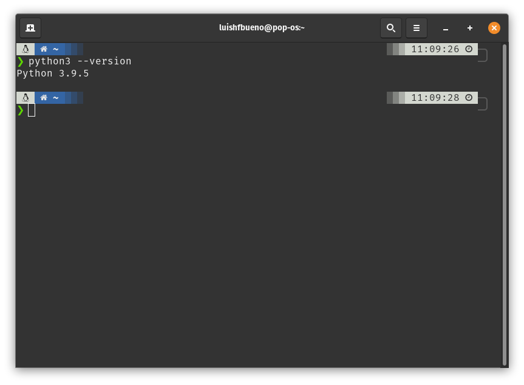
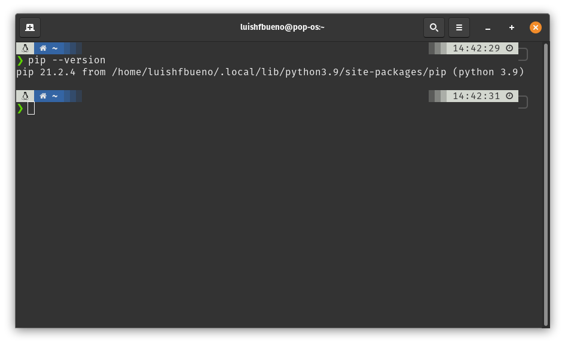
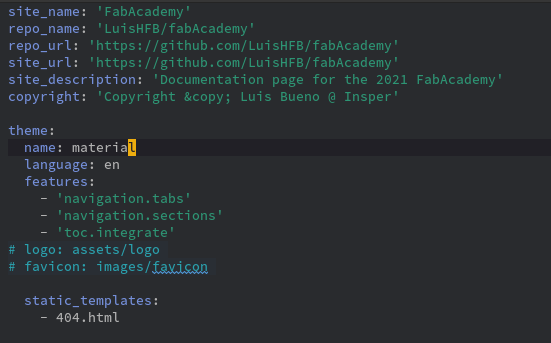

## Assignment

- Work through a git tutorial
- Build a personal site in the class archive describing you and your final project

## Personal Site

For building my documentation page I'll be using [MkDocs](https://www.mkdocs.org/) with the [Material for MkDocs Theme](https://squidfunk.github.io/mkdocs-material/) and [Github](https://github.com/) to create and manage my pages and files.

- **Git**: An open-source version control system used for creating a history of changes in the source code of software's development project.
- **GitHub**: A remote repository hosting service workins as an online Git.
- **Markdown**: A "text-to-HTML conversion tool for web writers" according to Jon Gruber, its creator. It is a tool that allows writing using plain text, converting it to a valid XHTML structure..
- **Mkdocs**: A static website generator for building project documention. Its source files are written in Markdown and set in a single YAML configuration file.

### Installing Python, Git, Mkdocs and Materials for Mkdocs

OS: [Pop!_OS](https://pop.system76.com/)(**Linux**)

Normally Linux comes with Python installed out of the box but to check it use in your terminal:

``` shell
python --version
```

In case Python is not installed check [this link](https://www.python.org/downloads/) and follow the documentation for installation steps.
If it's installed you'll receive a message like the one bellow:

{: .center}

Check if the [Pip](https://pypi.org/project/pip/) command is avaiable by typing the following:

``` shell
pip --version
```

If pip is installed, the terminal will return something like the image bellow:

{: .center}

Usually Pip is installed with Python.

Now is time to install Mkdocs, using the following command in the terminal:

``` 
pip install mkdocs
```

After the installation is done, it is going to be possible to start the website building. In the [Mkdocs website](https://www.mkdocs.org/) you can follow the first steps to prepare the documentation in your own static website. You cand find the guide in the 
[Getting Started](https://www.mkdocs.org/getting-started/) section.
This guide will teach you how to create a new project as wel as adding pages, theming the documentation and using icons through the YAML configuration file.
In my project, I used a theme called [Materials for Mkdocs](https://squidfunk.github.io/mkdocs-material/). Since it is a theme that does not come with Mkdocs, I needed to install it using the following line:

 ```
 pip install mkdocs-material
 ```

With the theme installed, I just needed to set the name **material** on the folowwing line in the mkdocs.yml file to use it.

{: .center}

Write the following command line in the terminal to preview the new site with the Material theme:

 ```
 mkdocs serve
 ```
