# CutStudio **Print & Cut**

## Criação de imagem

  Para a criação da imagem podemos utilizar qualquer programa, tanto vetorial(***Inkscape***) quanto editor de imagem normal(***GIMP***). Na criação da imagem é recomendado que se deixei uma sobra de cor antes da linha de corte, chamada de bleed mark, para que no momento do corte não fiquem falhas no fundo quando for colorido.
  Utilizando o Inkscape é necessário inserir um retângulo preenchido com a cor branca, pois na exportação, caso esteja sem fundo, é exportado um fundo preto.

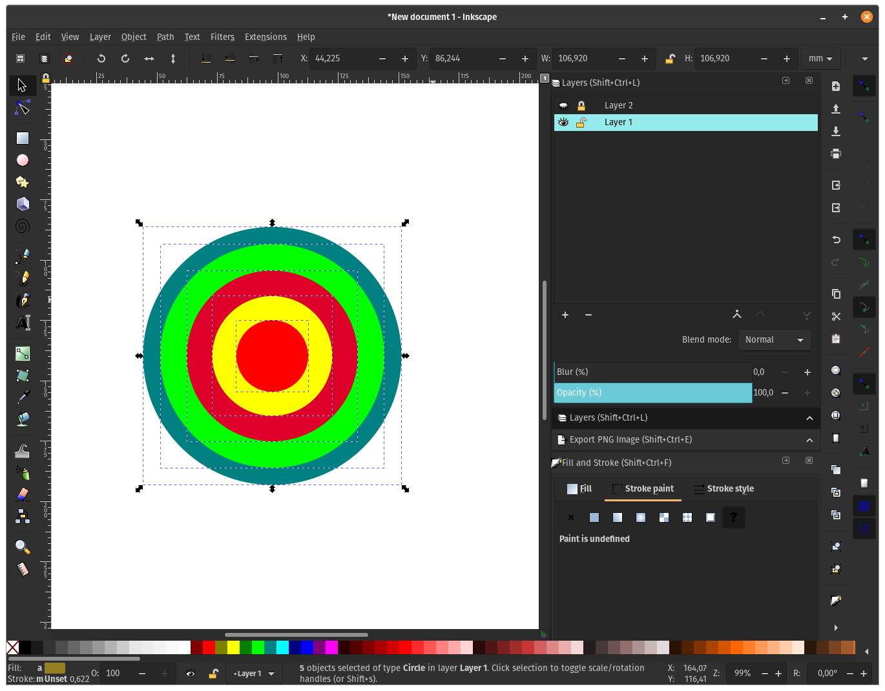{: .center}
 
## Criação de linha de corte

  Para a criação da linha de corte somente gerei uma imagem preenchida de preto por cima da imagem que será impressa.
  
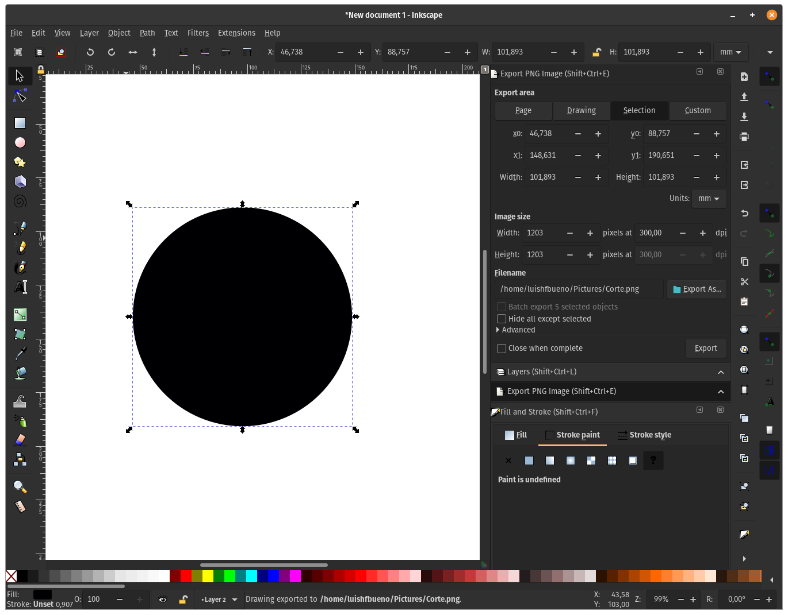{: .center}
  
## Exportando Imagem
  
 O CutStudio importa imagens em **.bmp** e **.jpg**. Apesar de informar que importa **.eps**, essa função só funciona utilizando o plugin proprietário da Roland para Illustrator e CorelDraw ou utilizando o plugin do Inkscape chamada **Roland CutStudio** (não consegui fazer funcionar). 
 A partir do Inkscape só é possível exportar arquivos em **.png** e **.jpg**, então vamos seguir pela última opção. Para exportar podemos usar o atalho ++shift+ctrl+e++ ou ir ao menu **File:arrow_right:Export PNG Image**

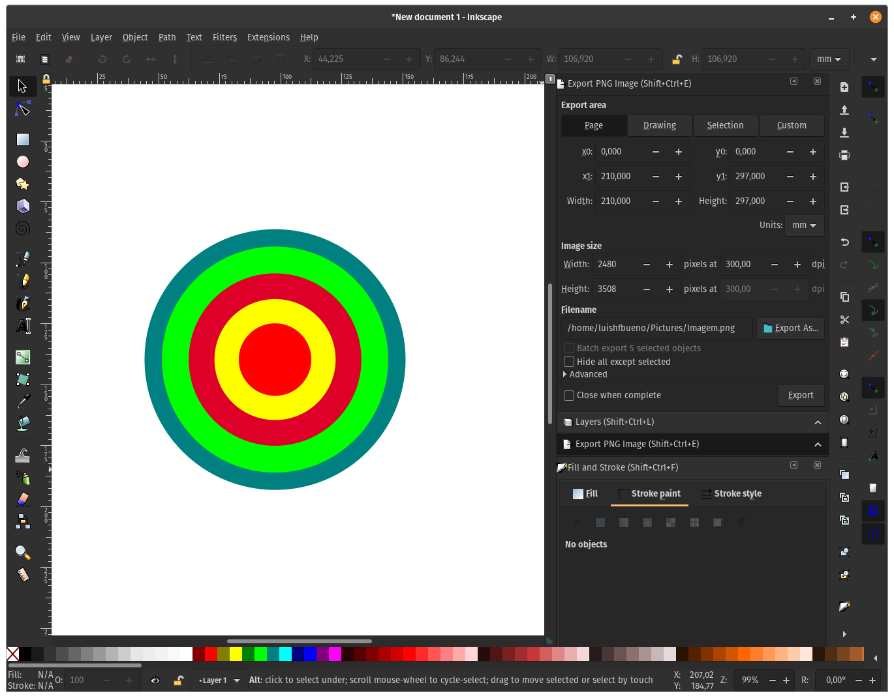{: .center}

{: .center}
 
## Importação no CutStudio
  
 Primeiro passo para utilizar as marcações é ativar a opção ***Print & Cut***
  
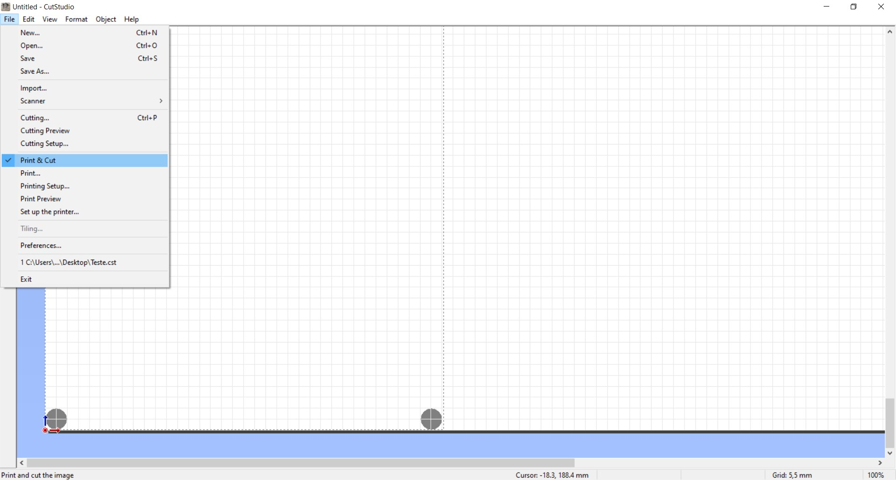{: .center}

 Logo após a ativação devem aparecer os marcadores na área de trabalho do CutStudio.

 Após ativação podemos ir em ***File:arrow_right:Import*** para importar os arquivos (recomendo começar pelo perfil de corte) e realizar a extração dos contornos em seguida clicando com o botão direito sobre a imagem e seleciona o ***Image Outline***
 
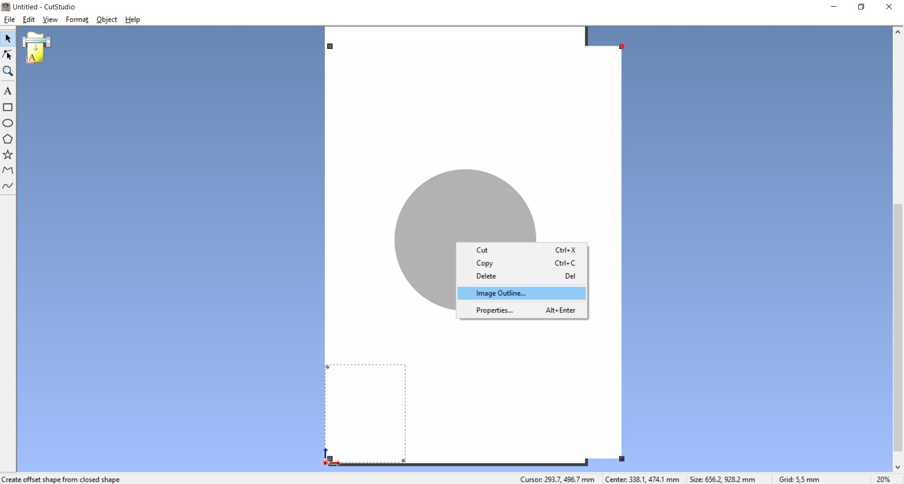{: .center}

 Ajuste o *Alignment Image Density* até obter o resultado desejado e clique em *Extract Contour Lines* para obter os vetores de corte.
 
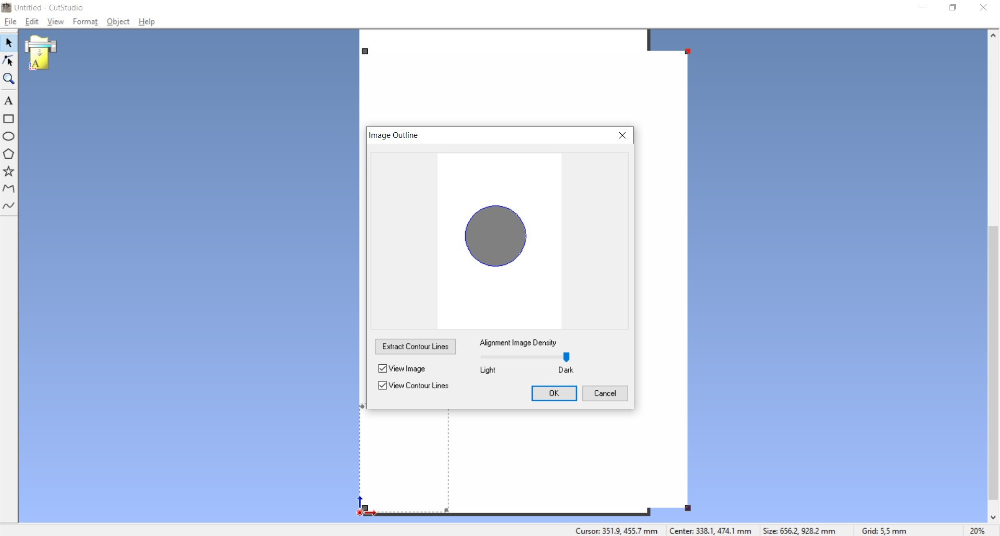{: .center}

 Agora delete a imagem inicialmente importada e importe a imagem que será impressa. Por serem feitas no mesmo arquivo devem se manter alinhadas e é possível ajustar a escala caso necessário selecionando o contorno  e a imagem e clicando com o botão direito e mudando o tamanho nas Propriedades da imagem.

 Ajuste a imagem e seu contorno dentro dos marcadores.
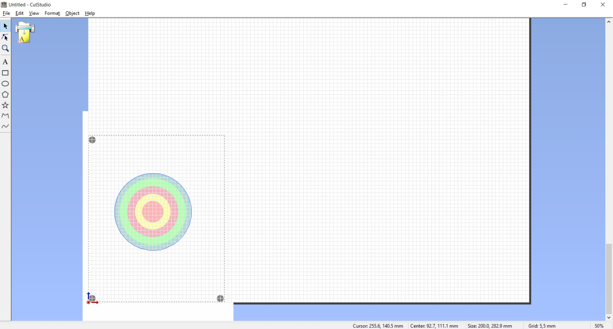{: .center}

## Impressão

 Selecione a opção em ***File:arrow_right:Print***
 
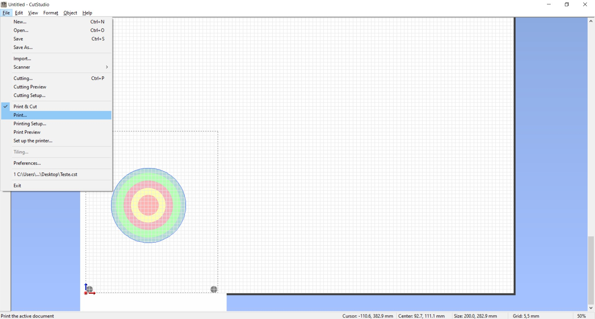{: .center}
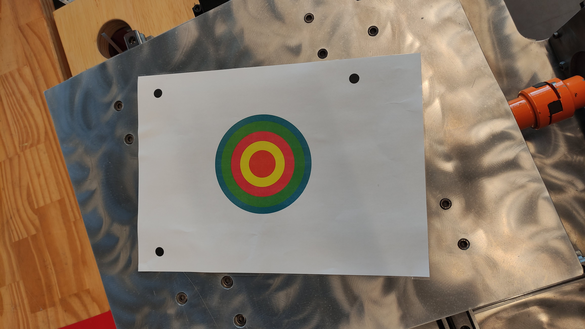{: .center}

## Instalação do vinil/etiqueta

Após a impressão é necessário instalar a folha na vinil, tomando o cuidado de mante-la alinhada e com os marcadores posicionados iguais a imagem no CutStudio.

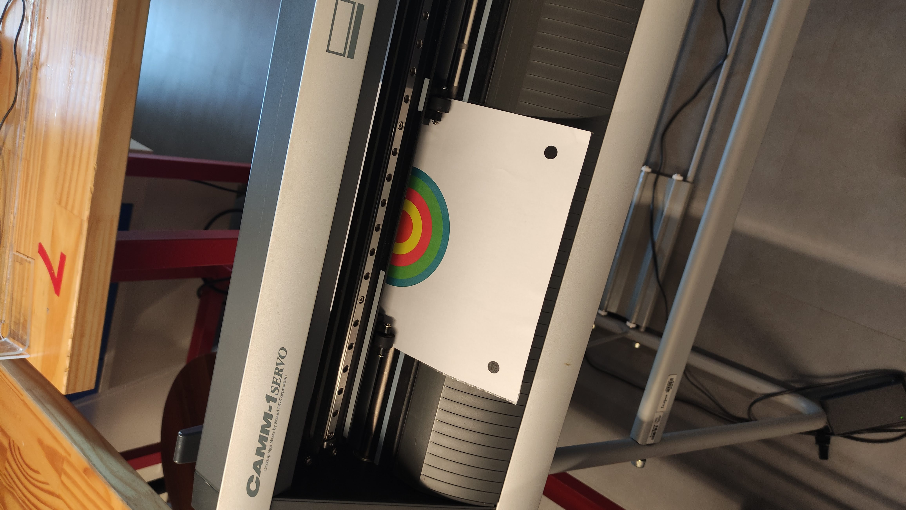{: .right} 
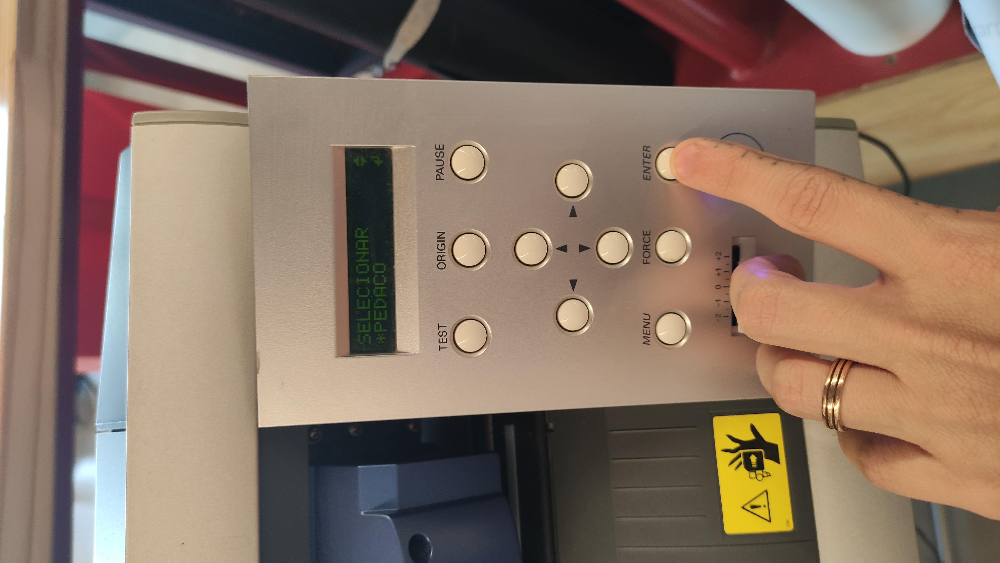{: .left}

## Corte

Pluge o computador na máquina caso não o tenha feito e digite ++ctrl+p++ ou ***File:arrow_right:Cutting*** para que a máquina começe o reconhecimento dos marcadores antes de realizar o corte.

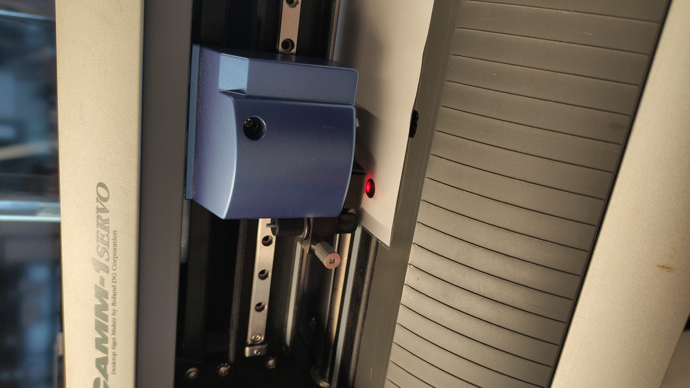{: .left}
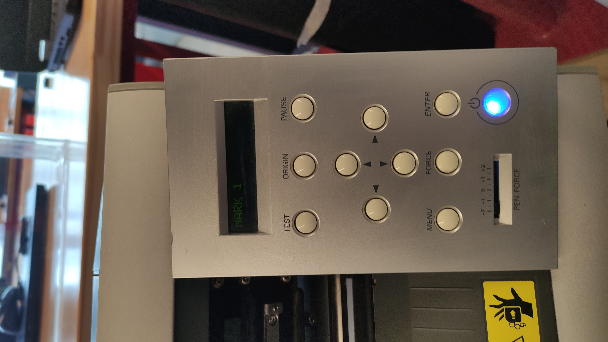{: .right}
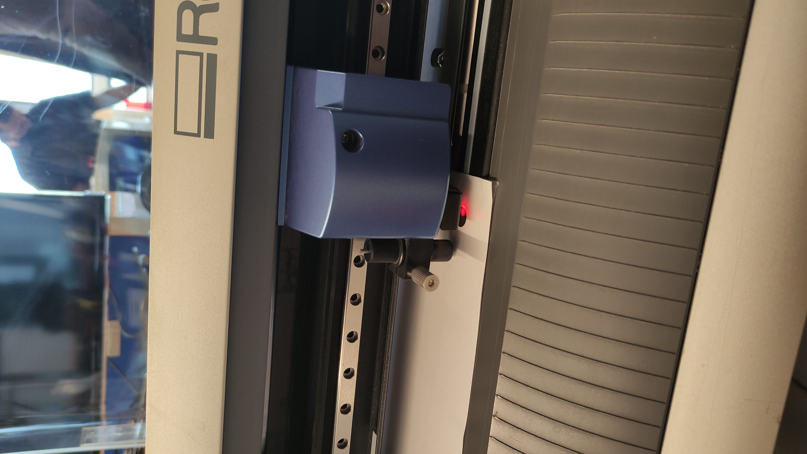{: .left}
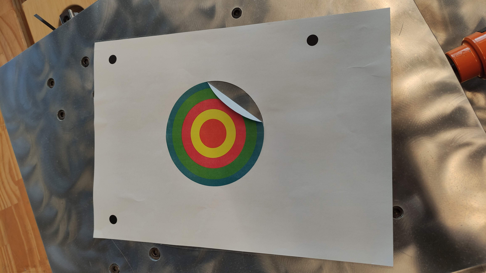{: .right}
