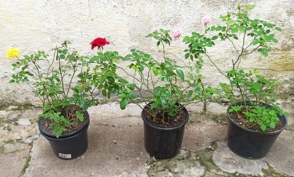
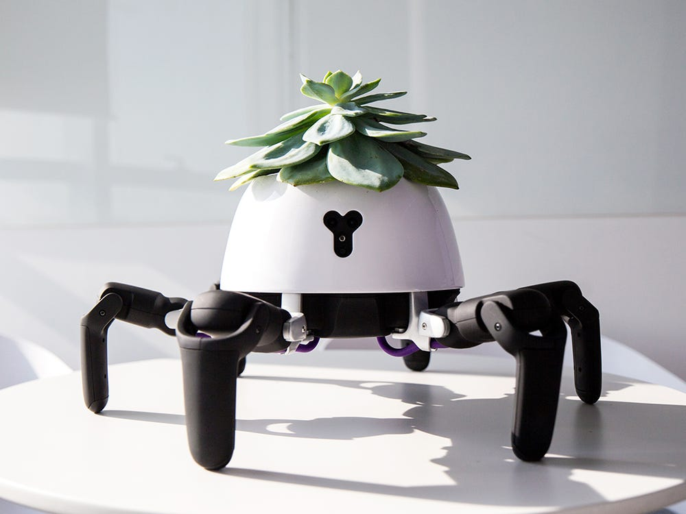
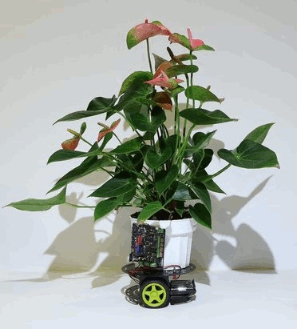
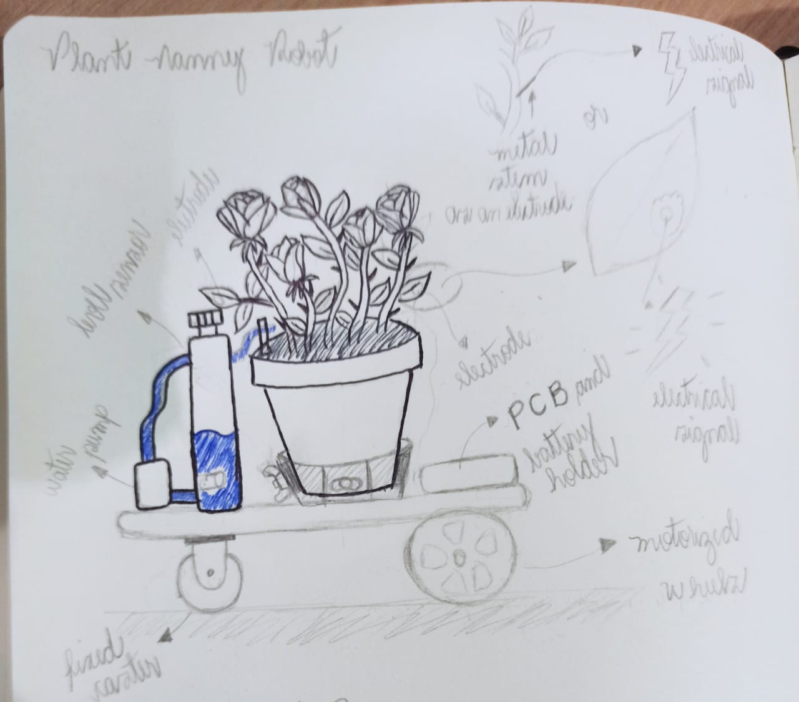

#1. Principles and Practices

##Assignment

* plan and sketch a potential final project

During this week I worked on defining my final project and started to create the documentation.
The project idea came from the task of water and put my plants under sunlight. I love to take care
of them, but sometimes I don't have enough time, specially when I'm travelling or so busy with work.
Majority of my plants is rose bushes which need many hours of daylight according to this [article](https://homeguides.sfgate.com/roses-need-full-sun-71200.html).
Therefore, I pass my days moving them to sunny places in my yard. So, why not to build a robot to do it for me? :smirk:

{: align=center style="height:240px"}

##References

In my research, I discovered some references to embase my project.
The first one is called [Hexa](https://www.businessinsider.com/the-hexa-robot-can-take-care-of-your-plants-2018-7), a walking succulent plant robot. It can move the plant in and out of shade and stomps when it needs watering. However, its design is very 
sophisticated. 

{: align=left style="height:215px"} 
<video controls width="400" align="center">

    <source src="https://user-images.githubusercontent.com/80481667/121596606-03fdfb80-ca16-11eb-96ab-62e88dee66aa.mp4"
            type="video/mp4">

    Sorry, your browser doesn't support embedded videos.
</video>

The second is [Elowan](https://www.media.mit.edu/projects/elowan-a-plant-robot-hybrid/overview/), a cybernetic lifeform.
The project uses the plant signals to guide it toward light. 

{: align=left style="height:300px"}
<iframe width="534" height="300" src="https://www.youtube.com/embed/rptKlKZc7cs" title="YouTube video player" frameborder="0" allow="accelerometer; autoplay; clipboard-write; encrypted-media; gyroscope; picture-in-picture" allowfullscreen></iframe>

##PNR - Plant Nanny Robot

I'm not an expert in drawing, but here's my sketch:

{: align=center style="height:450px"}

###Description

The **Plant Nanny Robot (PNR)** is a robotic mobile platform that takes care of a plant. 

It moves itself forward or back toward natural light incidence, to keep the rose bush for longer under sunshine.
It uses metal electrodes conect to the ground and plant stem for Reading its signals. According to [TED](https://www.ted.com/talks/greg_gage_electrical_experiments_with_plants_that_count_and_communicate#t-120040) of Greg Gage in 2017,
plants can communicate through electrical signals that can change with an external touch/motion, or also because 
light as [Elowan]( https://www.media.mit.edu/projects/elowan-a-plant-robot-hybrid/overview/) project.

Para evitar esbarrar em obstáculos ou até mesmo em pessoas/animais de estimação possui um sensor que para seu movimento se necessário.

Além do banho de sol, o PNR cuida da umidade do solo da planta. Através do sensor artesanal implantado no solo que avisa quando é necessário
a rega (ativando a bomba d’água). Seu mini reservatório conta com um sensor de nível do tipo reed switch para notificar ao proprietário do nível
abaixo (através de um led) e também para paralisar o sistema de rega até o reabastecimento.

O sistema de fixação do vaso de planta ocorrerá através de molas, parafusos e porcas borboletas.

Pessoas que precisam viajar por um curto período de tempo (duas semanas) ou que não possuem tempo hábil para os cuidados básicos das 
plantas podem utilizar o PNR, garantindo assim a sobrevivência dos seus amores verdinhos. 

