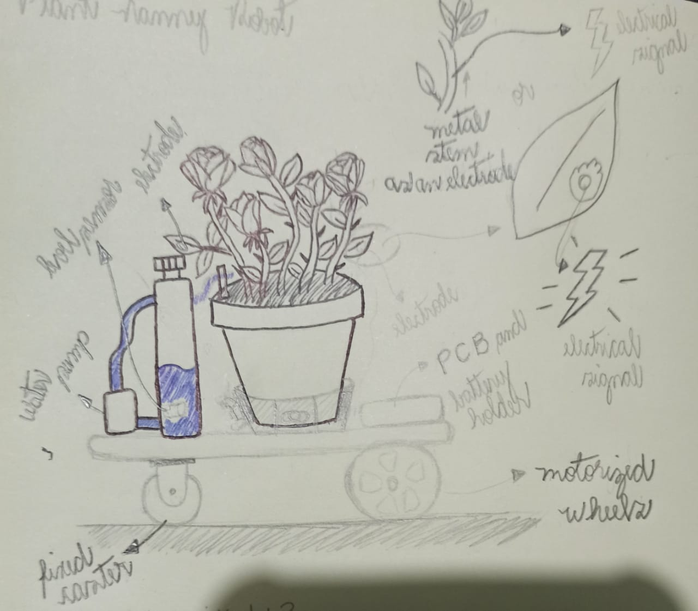
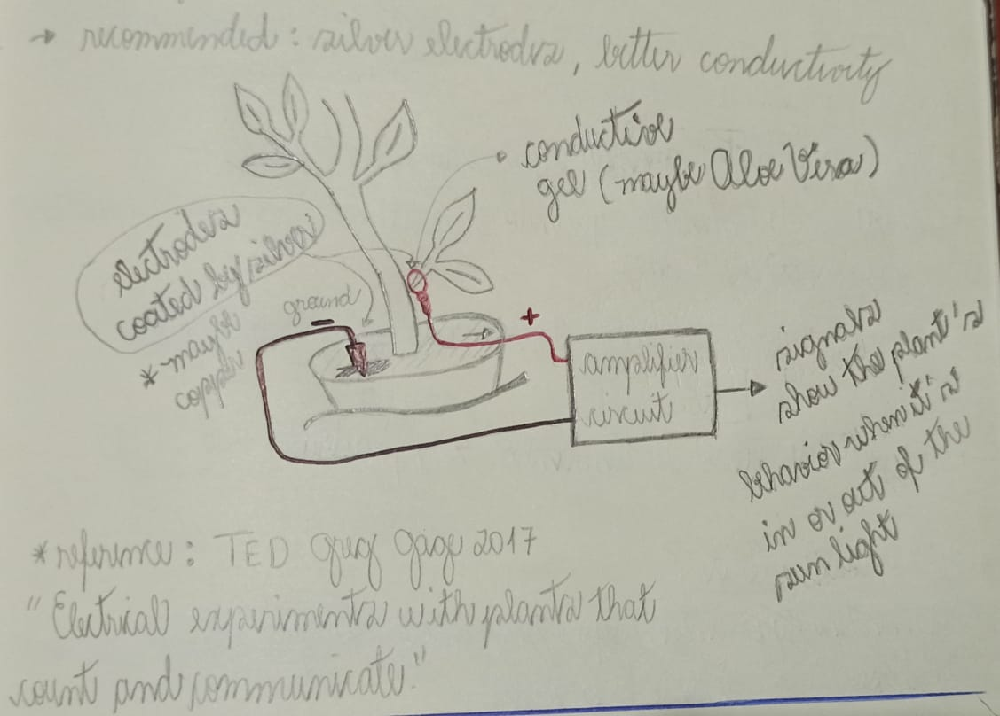

#1. Principles and Practices

##Assignment

* Plan and sketch a potential final project

During this week I worked on defining my final project and started to create the documentation.
The project idea came from the task of water and put my plants under sunlight. I love to take care
of them, but sometimes I don't have enough time, specially when I'm traveling or so busy with work.
Majority of my plants is rose bushes which need many hours of daylight according to this [article](https://homeguides.sfgate.com/roses-need-full-sun-71200.html).
Therefore, I pass my days moving them to sunny places in my yard. So, why not to build a robot to do it for me? :smirk:

{: align=center style="height:240px"}

##References

In my research, I discovered some references to embase my project.
The first one is called [Hexa](https://www.businessinsider.com/the-hexa-robot-can-take-care-of-your-plants-2018-7), a walking succulent plant robot. It can move the plant in and out of shade and stomps when it needs watering. However, its design is very
sophisticated.

{: align=left style="height:215px"}
<video controls width="400" align="center">

    <source src="https://user-images.githubusercontent.com/80481667/121596606-03fdfb80-ca16-11eb-96ab-62e88dee66aa.mp4"
            type="video/mp4">

    Sorry, your browser doesn't support embedded videos.
</video>

The second is [Elowan](https://www.media.mit.edu/projects/elowan-a-plant-robot-hybrid/overview/), a cybernetic lifeform.
The project uses the plant signals to guide it toward light.

{: align=left style="height:300px"}
<iframe width="534" height="300" src="https://www.youtube.com/embed/rptKlKZc7cs" title="YouTube video player" frameborder="0" allow="accelerometer; autoplay; clipboard-write; encrypted-media; gyroscope; picture-in-picture" allowfullscreen></iframe>

##PNR - Plant Nanny Robot

I'm not an expert in drawing, but here's my sketch:

{: align=center style="height:500px"}

###Description

The **Plant Nanny Robot (PNR)** is a robotic mobile platform that takes care of a plant.

It moves itself forward or back toward natural light incidence, to keep the rose bush for longer under sunshine.
It uses metal electrodes connected to the ground and plant stem for reading its signals. According to [TED of Greg Gage in 2017](https://www.ted.com/talks/greg_gage_electrical_experiments_with_plants_that_count_and_communicate#t-120040),
plants can communicate through electrical signals that can change with an external touch/motion, or also because of
light as [Elowan project]( https://www.media.mit.edu/projects/elowan-a-plant-robot-hybrid/overview/).

{: align=center style="height:450px"}

To avoid bumping into obstacles, and even into people or pets, there is an ultrasonic sensor that stops the robot's motions if necessary.

Beyond sunbath, the PNR takes care of soil moisture. Through the handmade sensor that warns when watering is needed
(turning on the water pump). Its mini reservoir has a level sensor of reed switch type that notifies the owner about
the low water level (through an LED) and also blocks the watering system until refueling.

All signals from sensors and commands will be processed by a microcontroller PCB.

People who need traveling for a short period (two weeks) or that don't have enough time to basic care of their plant, can
use the PNR, ensuring the survival of their green loves.
