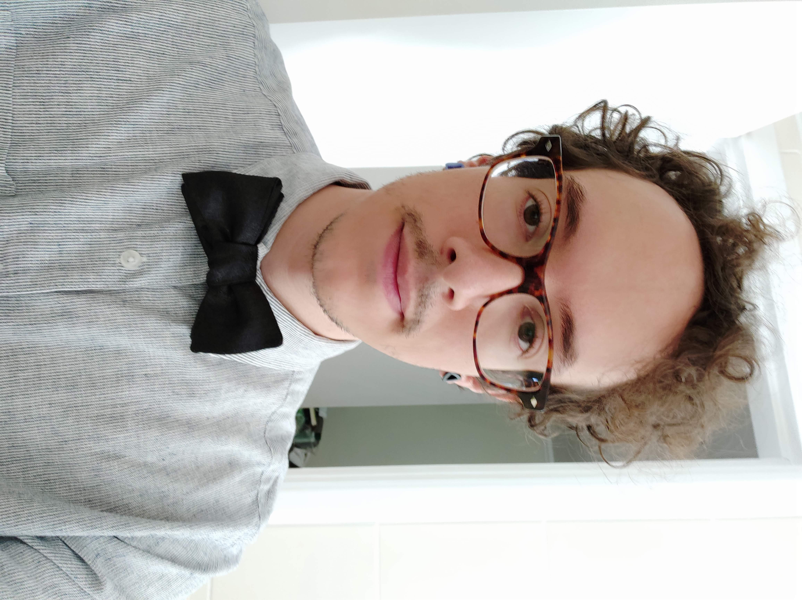

# About me

{: .center style="height:300px"}

Hello, my name is ***Luís Henrique Fonseca Bueno*** and I'm an curious Industrial Designer that has been working at Insper Fablab since mid 2015. I was born and raised in São Paulo/Brazil 

## Background

 As a child I was always the restless one that wanted to see what was inside everything and was always disassembling and breaking all my toys. Because of my curiosity I was always helping my father and grandparents to do some home repairs, fixing basic electronics and as I grow old started fixing cellphone/smartphones.
 
 {: .center}

 I started studying Mechanical Engineering in 2007 and made my way to halfway the course and decided to switch paths and started studying Industrial Design instead. There I got exposed to a wide range of manufacturing methods and could experiment with a lot of them during the course.

{: .left style="max-height:30vh"}
{: .right style="max-height:30vh"}

{: .left style="max-width:40vh"}
{: .right style="max-width:40vh"}

 After graduating I worked designing injection molds and tooling for a company that made tire retreading tools . There I got a lot of experience working with and programming CNC's manually and with CAM software such as SolidCAM and RhinoCAM. I also learned how to use a lathe, knee mills, surface grinders and a lot of other Machine Shop tools.

{: .left style="max-width:45vh"}
{: .right style="max-width:55vh"}

## Insper FabLab

{: .left style="max-width:55vh"} 
{: .right style="max-width:55vh"}
